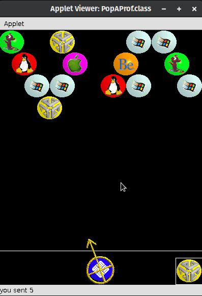

# Pop-A-Prof 

This is the source and binaries
of my final project for the Java class
at Millersville University, May 2000.

Pop-A-Prof is a clone of Bust-a-Move
with multiple themes,
including heads of professors 
at the time.
It played as a sort of "death-match"
where you'd play against any number 
of people who were in the one global match.
You'd fill up your screen, die, but then restart 
with a penalty to your score.
Rounds were 5 minutes.

We demonstrated the game in class 
with 20+ people playing.
It was chaos.

It's Java 1.2, so it doesn't currently compile with newer JDKs.

It ran a PopServer to coordinate the game,
and the actual game ran in the browser as an applet.

